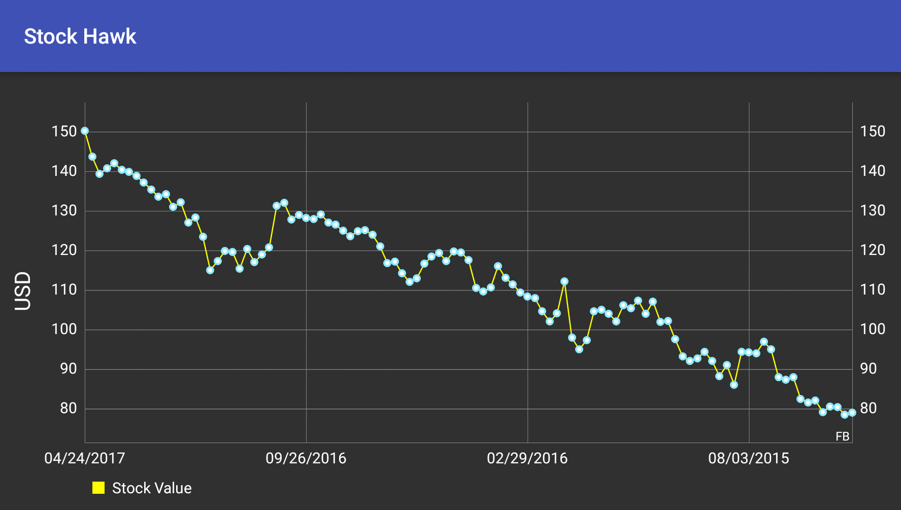

# Stock Hawk

An Android app that fetches a list of stocks from Yahoo Finance API. The app allows the user to add as many stocks as desired. The user can view a plotted graph of the stocks value over a period of time. The app also includes a widget making it easy for the user to keep an eye on his favorites stocks. 

## Screenshots

## Getting Started
The below instruction will get you a copy of the project up and running on your machine for development and testing purposes.
### Prerequisites
Android Studio including SDK version 25 and build tools version 25.0.2.  
You can always update to the latest versions. 

### Installing and Deployment
1. Import the project to your Android Studio
2. Build the project
3. Install the APK on your device or an emulator

### Built With
[Android Studio](https://developer.android.com/studio/index.html) - The IDE used  
[Gradle](https://gradle.org/) - Dependency Management

### Libraries Used
[MPAndroidChart](https://github.com/PhilJay/MPAndroidChart)  
[butterknife](http://jakewharton.github.io/butterknife/)  
[timber](https://github.com/JakeWharton/timber)  
[YahooFinanceAPI](https://github.com/sstrickx/yahoofinance-api)  

### Contributing 
Pull requests are gracefully accepted. 

### License
The project is licensed under the MIT License - see [LICENSE.txt](LICENSE.txt) file for detail.

### Acknowledgments
A skeleton code was used from Udacity as part of a project in the Android Developer Nanodegree.
Check out Udacity's [Advanced Android App Development](https://www.udacity.com/course/advanced-android-app-development--ud855) course to take a look at the skills need to complete this project!

